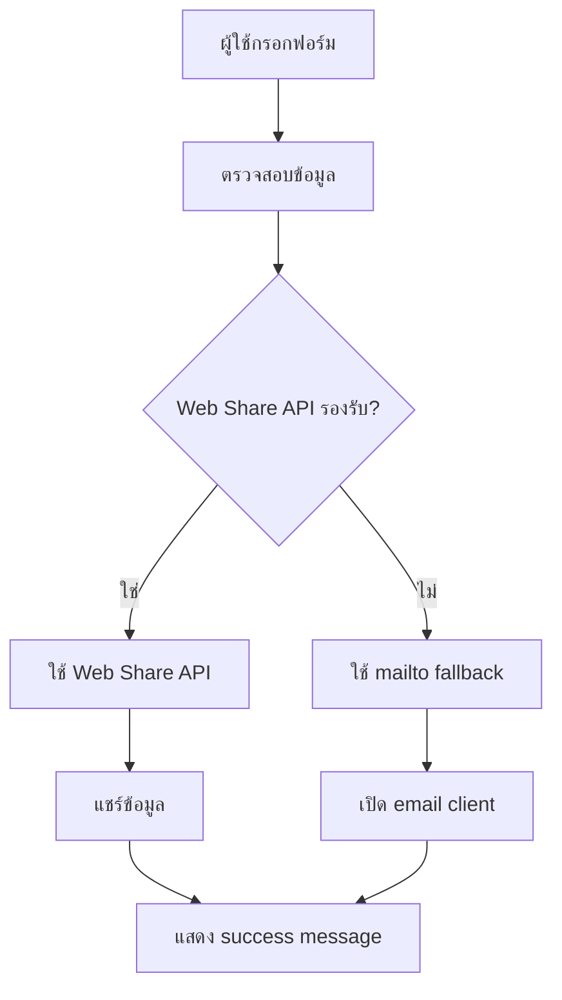

# Dolce Villa Samui - Email System

## ระบบส่งอีเมลผ่าน Email ของลูกค้า

ระบบนี้ใช้ email ของลูกค้าที่กรอกในฟอร์มเพื่อส่งอีเมลไปยัง `kantapong@dolcevillasamui.com` โดยไม่ต้องเปิดแอปภายนอก

### 🚀 คุณสมบัติ

- ✅ **ใช้ Email ของลูกค้า** - ระบบจะใช้ email ที่ลูกค้ากรอกในฟอร์ม
- ✅ **ไม่ต้องเปิดแอปภายนอก** - ทำงานในเบราว์เซอร์โดยตรง
- ✅ **รองรับหลายวิธี** - Web Share API, mailto fallback
- ✅ **Responsive Design** - รองรับทุกขนาดหน้าจอ
- ✅ **Loading States** - แสดงสถานะการส่ง
- ✅ **Error Handling** - จัดการข้อผิดพลาด

### 📧 วิธีการทำงาน

1. **Web Share API** (ถ้ารองรับ):
   - ใช้ `navigator.share()` สำหรับอุปกรณ์ที่รองรับ
   - แชร์ข้อมูลผ่านแอปที่ติดตั้งไว้

2. **Mailto Fallback**:
   - เปิด email client ของผู้ใช้
   - Pre-fill ข้อมูลทั้งหมด
   - ใช้ email ของลูกค้าเป็น sender

3. **API Integration** (สำหรับอนาคต):
   - ส่งผ่าน server-side API
   - รองรับการส่งแบบ serverless

### 🔧 การใช้งาน

#### 1. รัน Development Server
```bash
npm run dev
```

#### 2. เปิดเว็บไซต์
```
http://localhost:5173
```

#### 3. ทดสอบฟอร์ม
1. ไปที่หน้า Contact
2. กรอกข้อมูลในฟอร์ม "Schedule a Private Viewing"
3. คลิก "Send Message"
4. ระบบจะเปิด email client หรือแชร์ข้อมูล

### 📁 ไฟล์ที่เกี่ยวข้อง

- `src/components/Contact.tsx` - ฟอร์มติดต่อ
- `src/services/EmailService.ts` - บริการส่งอีเมล
- `public/api/send-email.html` - API endpoint (fallback)

### 🌐 การ Deploy

#### Frontend (Vercel/Netlify)
```bash
npm run build
# Deploy dist/ folder
```

#### API Endpoint
- อัปโหลด `public/api/send-email.html` ไปยัง web server
- หรือใช้ serverless functions (Vercel, Netlify Functions)

### 🔄 การทำงานของระบบ



### 📱 การรองรับ

- ✅ **Desktop**: Chrome, Firefox, Safari, Edge
- ✅ **Mobile**: iOS Safari, Chrome Mobile, Samsung Internet
- ✅ **Tablet**: iPad Safari, Android Chrome

### 🛠️ การแก้ไขปัญหา

#### Email ไม่เปิด
- ตรวจสอบว่าเบราว์เซอร์รองรับ mailto
- ลองใช้เบราว์เซอร์อื่น

#### Web Share ไม่ทำงาน
- ตรวจสอบ HTTPS connection
- ใช้บนอุปกรณ์จริง (ไม่ใช่ simulator)

#### ฟอร์มไม่ส่ง
- ตรวจสอบ console สำหรับ errors
- ตรวจสอบ validation

### 🔮 การพัฒนาต่อ

1. **EmailJS Integration**:
   - เพิ่ม EmailJS สำหรับส่งอีเมลแบบ serverless
   - รองรับ HTML templates

2. **Server-side API**:
   - สร้าง backend API สำหรับส่งอีเมล
   - ใช้ Nodemailer หรือ SendGrid

3. **Email Templates**:
   - สร้าง HTML templates สวยงาม
   - รองรับ responsive design

### 📞 การติดต่อ

- **Email**: kantapong@dolcevillasamui.com
- **Phone**: +66 85 564 9899
- **Address**: Soi Pratamnak, Bophut, Koh Samui, Thailand
